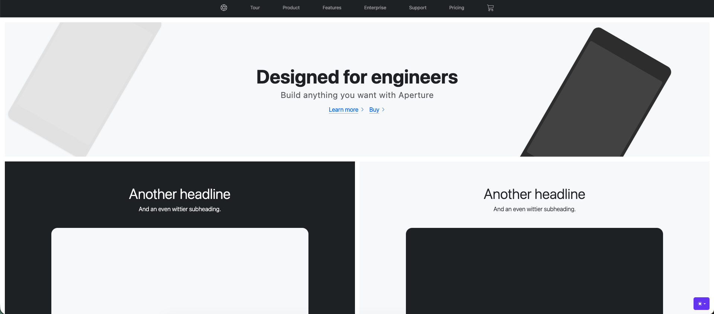
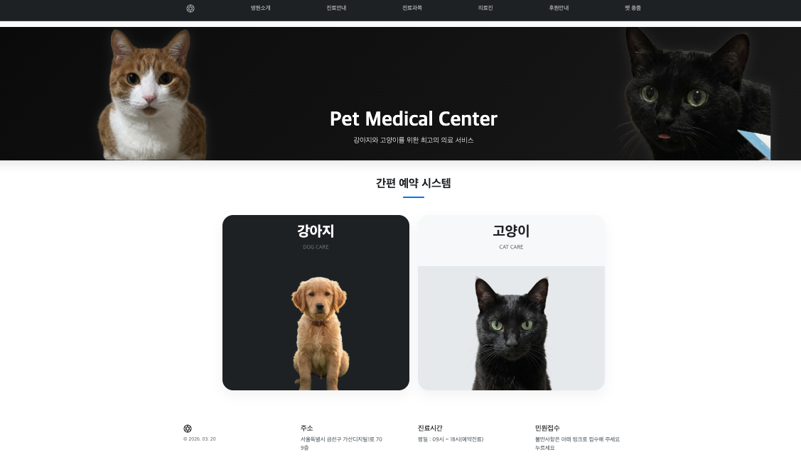
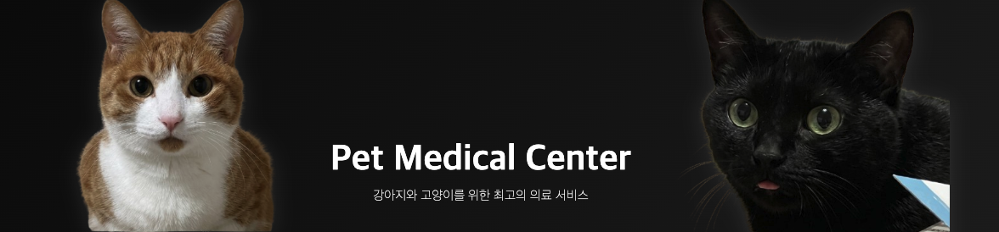
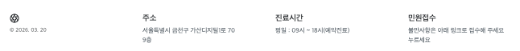

# 🐾 Pet Medical Center (강아지 / 고양이 전문 동물병원)

> 부트스트랩(Bootstrap)을 활용하여 제작한 **반려동물 의료 센터**의 간편 예약이 가능한 페이지입니다. 사용자 편의를 고려한 모달(Modal) 기반 예약 기능을 제공합니다.

---

## 🚀 주요 기능

## 1. 페이지 UI구성
> Bootstrap 예시 페이지
 

> 커스터마이징 페이지


---

### 2. 섹션 별 기능
-  네비게이션 메뉴


> 1. "후원안내" 클릭 시 후원 계좌를 팝업창으로 출력
> 2. "펫 용품" 클릭 시 쇼핑몰 연결

---

-  히어로 섹션(메인 비주얼)


> 1. 마우스 호버 시 이미지 확대 효과
> 2. 귀여움

---
- 예약 카드


> 1. 강아지/고양이  카드 클릭 시 해당 동물에 맞는 예약 모달 팝업
> 2. 오늘 이전 날짜 선택 불가 처리
> 3. 연락처 유효성 검사 ( 010-0000-0000 형식만 허용)
> 4. 예약 확정 시 예약 정보 알림창 출력

- 하단 푸터


> 1. ">>누르세요<<" 클릭 시 민원 페이지 이동
> 2. 마우스 호버 시 파란색으로 색상 변경

---

## 🛠 사용 기술 및 라이브러리
> 


>
> - **Frontend**: HTML5, CSS3, JavaScript (ES6+)
> - **Framework**: [Bootstrap v5.3](https://getbootstrap.com/)

---
## 📌 참고
- Bootstrap 공식 Product 예제를 기반으로 커스터마이징
- 이미지 출처: 우리집 고양이 / Gemini Ai 이미지


---

## 📂 프로젝트 구조

```text
.
├── index.html       # 메인 페이지 구조 및 자바스크립트 로직
├── product.css      # 스타일시트
├── images/          # 프로젝트에 사용된 이미지
└── README.md        # 프로젝트 소개 문서

